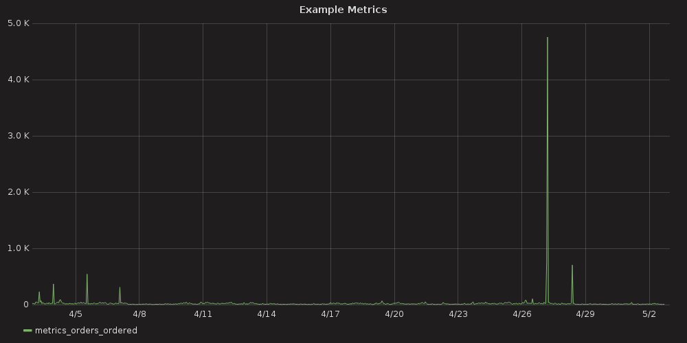

# Chameleon-Admin-Console

**PROVISIONAL SOFTWARE DISCLAIMER**: This software is preliminary and is subject to revision. 

Codename chameleon provides utilities to gain insights into the database, system status, logging,
etc.



## Usage

Start up the backend services:
```bash
docker-compose up [--build]
```

Now, users may navigate to the [grafana dashboard](http://127.0.0.1:3000/):

* [grafana http api](http://docs.grafana.org/http_api/)
### Setup Data source
```bash
http -a admin:secret POST ":3000/api/datasources" name=chameleon type="grafana-simple-json-datasource" url="http://chameleon:5445/api/" access="proxy" basicAuth:=false
```
```json
HTTP/1.1 200 OK
Content-Length: 56
Content-Type: application/json; charset=UTF-8
Date: Wed, 03 May 2017 21:40:22 GMT

{
    "id": 1, 
    "message": "Datasource added", 
    "name": "chameleon"
}
```

### Setup Dashboard
* Go to import [new dashboard](http://127.0.0.1:3000/dashboard/new?editview=import)
  * Select `Upload .json File` and navigate to [user_metrics.json](dashboards/user_metrics.json)
  * Will have to select "chameleon" as the datasource
  * Select `Import`

### Setup Templating
This dashboard comes with templating already configured. 
If you want to globally change parameters across all panels in a dashboard:
* On the dashboard page, select `⚙ (Manage Dashboard) > Templating` and `New`
  * Create a "source" template, of `Query` type, connected to the datasource we created
    * As an example: `templates.metrics.orders_ordered.source`
    * Check the `Include All option` [optional]
  * Now, change the metric to use the new `$source` template
    * Example: `metrics.orders_ordered.source=$source`
  * The dashboard will now have a template control header with dropdowns


### Create a new user

```bash
$ http -a admin:secret POST ":3000/api/admin/users" name=UserP login=UserP password=pass1
```
```json
HTTP/1.1 200 OK
Content-Length: 33
Content-Type: application/json; charset=UTF-8
Date: Wed, 03 May 2017 21:18:34 GMT

{
    "id": 3, 
    "message": "User created"
}

```

## Quick Links

Swagger creates documentation of our internal API automagically :tada: : 
* [Swagger Auto API Docs](http://127.0.0.1:5445/autodocs)


## References

* [simple-json](https://github.com/grafana/simple-json-datasource)
* [flask-restplus](https://github.com/noirbizarre/flask-restplus)
* [grafana-docker - github](https://github.com/grafana/grafana-docker)

* [grafana - DockerHub](https://hub.docker.com/r/grafana/grafana/)
* [postgres - DockerHub](https://hub.docker.com/_/postgres/)

